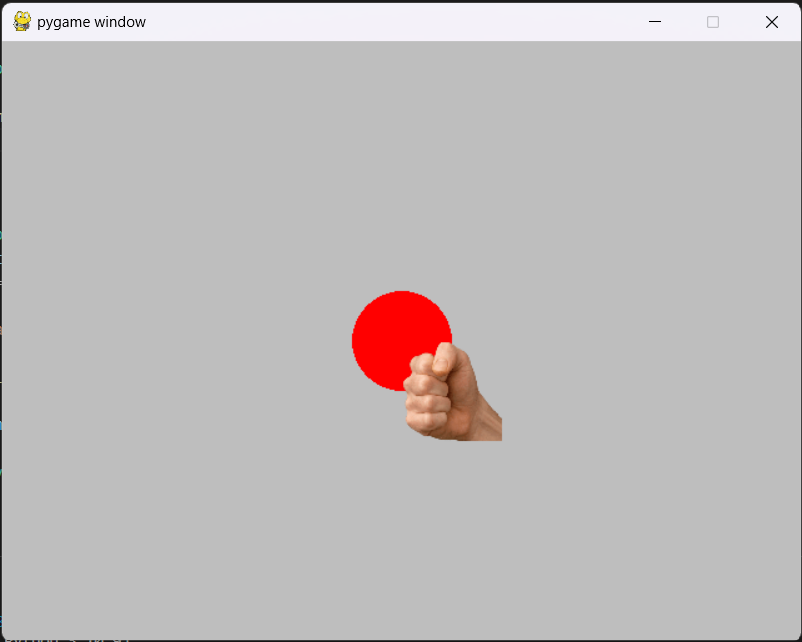
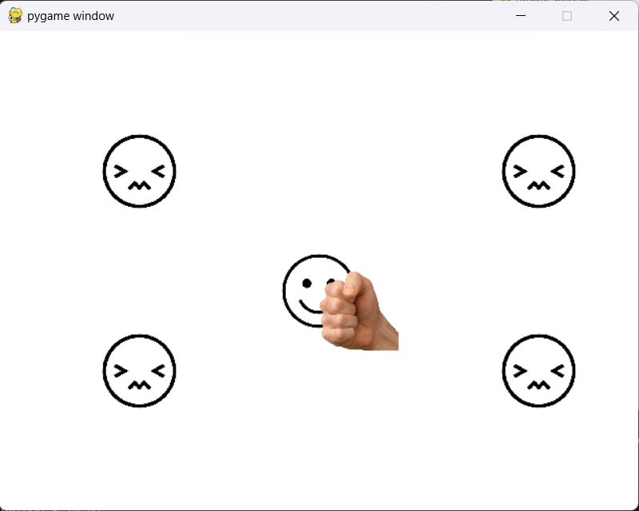

# Introdução ao Pygame 

O Pygame é uma biblioteca de código aberto em Python que é amplamente utilizada para o desenvolvimento de jogos 2D e aplicações multimídia interativas. Ele fornece funcionalidades para lidar com gráficos, som, entrada de teclado e mouse, colisões, e muito mais. Este roteiro vai te guiar no processo de instalação do pygame e criação do seu primeiro jogo. No processo será abordado o loop de jogo típico. 


## Instalação

Para instalar o pygame, abra o terminal de comandos e use o comando abaixo: 

```
python -m pip install pygame --user
```

Para verificar se a instalação deu certo, execute o comando: 

```
python -c "import pygame"
```

O resultado esperado é a mensagem abaixo, possivelmente com valores diferentes das versões: 

```
pygame 2.1.2 (SDL 2.0.18, Python 3.10.9)
Hello from the pygame community. https://www.pygame.org/contribute.html
```

Se for exibida uma mensagem dizendo que o programa python não foi encontrado, o interpretador python precisa ser instalado ou reinstalado. Se a mensagem abaixo for exibida, aconteceu algum problema e a biblioteca pygame não foi instalada. Entre em contato com o professor para verificar o que aconteceu. 

```
Traceback (most recent call last):
  File "<string>", line 1, in <module>
ModuleNotFoundError: No module named 'pygame'
```

## O Primeiro Jogo: Punch the Happy People

O primeiro jogo que desenvolveremos será bem simples e tem como objetivo compreender a estrutura básica de código utilizada na grande maioria dos jogos, o loop de jogo. 

### Tema

No primeiro jogo, o personagem será uma pessoa chateada que não gosta de ver ninguém feliz. O jogo será em primeira pessoa e só veremos o punho do personagem. Na tela existirá um rosto feliz que se movimentará pela tela. Sempre que o personsagem acertar um soco no rosto feliz, ele se torna um rosto triste e o personagem ganha um ponto. Depois de 2 segundos, o rosto volta a ser feliz. 

### Ações

O jogador poderá realizar ações utilizando as teclas do teclado: 

- a: move o punho para a esquerda
- d: move o punho para a direita
- w: move o punho para cima
- s: move o punho para baixo 
- j: realiza um soco
- ESC: fecha a janela do jogo


### O Loop de Jogo


O loop de jogo é a estrutura fundamental de qualquer jogo em Pygame (e na maioria das bibliotecas de jogos). Ele permite que o jogo seja executado continuamente e responda às ações do jogador e a outras mudanças no ambiente do jogo. O loop de jogo é responsável por atualizar a lógica do jogo, desenhar a tela e lidar com eventos.

Um loop de jogo típico em Pygame consiste em três partes principais:

- Tratamento de Eventos: O loop começa tratando todos os eventos que ocorrem no jogo. Os eventos podem ser coisas como cliques do mouse, pressionamentos de teclas, fechamento da janela do jogo, etc.

- Atualização da Lógica do Jogo: Depois de tratar os eventos, a lógica do jogo é atualizada. Isso envolve calcular novas posições de objetos, verificar colisões, atualizar pontuações, etc.

- Renderização: Finalmente, a tela do jogo é atualizada para refletir as mudanças na lógica do jogo. Isso inclui desenhar personagens, objetos e outros elementos visuais na tela.

Para ilustras estas idéias, vamos criar o loop de jogo mais simples possível usando o pygame. Crie um arquivo chamado ```001_punch.py``` com o conteúdo abaixo: 

```
import pygame

pygame.init()
tela = pygame.display.set_mode((640, 480))

sair = False

while not sair:
    for event in pygame.event.get():
        if event.type == pygame.QUIT:
            sair = True

    tela.fill("white")

    pygame.display.flip()

pygame.quit()
```

Ao executar o programa, é esperado que uma janela com fundo branco abra e seja exibida até que o botão de fechar (o X no canto direito superior) seja clicado. 

Agora, vamos explicar o código linha a linha:


```
import pygame
```

Aqui, estamos importando o módulo pygame, que é a biblioteca usada para criar jogos em Python.

```
pygame.init()
```

Essa linha inicializa o Pygame. É uma etapa necessária para usar as funcionalidades do Pygame.

```
tela = pygame.display.set_mode((640, 480))
```

Nesta linha, estamos criando uma janela (ou tela) de exibição do jogo com uma resolução de 640x480 pixels. A variável tela é uma referência à janela do jogo, que será usada para desenhar objetos e elementos na tela.

```
sair = False
```

Aqui, estamos criando uma variável chamada sair e a inicializando como False. Essa variável será usada para controlar quando o loop de jogo deve terminar.

```
while not sair:
```

Este é o início do loop de jogo principal. Enquanto a variável sair for False, o jogo continuará a ser executado.

```
    for event in pygame.event.get():
```

Neste trecho, estamos verificando todos os eventos que ocorreram desde a última vez que verificamos. Isso é feito usando o pygame.event.get(), que retorna uma lista de eventos.

```
        if event.type == pygame.QUIT:
```

Aqui, estamos verificando se o tipo de evento é o fechamento da janela do jogo (pygame.QUIT). Isso ocorre quando o jogador fecha a janela do jogo.

```
            sair = True
```

Se o evento for o fechamento da janela, definimos a variável sair como True, o que fará com que o loop de jogo saia, encerrando o jogo.

```
    tela.fill("white")
```

Aqui, estamos preenchendo a tela com a cor branca. Isso é feito para limpar qualquer conteúdo anterior na tela e preparar a tela para ser redesenhada.

```
    pygame.draw.circle(tela, "red", (320, 240), 40)
```

A linha acima desenha um círculo na tela de cor vermelha, com centro na linha 240 e coluna 320 e com raio de 40 pixels. 

```
    pygame.display.flip()
```

Esta linha atualiza a tela, exibindo qualquer coisa que tenha sido desenhada nela desde a última atualização.

```
pygame.quit()
```

Finalmente, ao sair do loop de jogo, estamos chamando pygame.quit() para finalizar a biblioteca Pygame de forma apropriada.

**Atividade**: Mude a cor de fundo da janela de "white" para "blue", "black" ou "green" e execute o programa novamente para verificar se a mudança de fato aconteceu. 

**Atividade**: Mude os parâmetros de desenho do círculo como a posição, a cor e o raio. Execute o programa para verificar que as mudanças surtiram efeito. Desenhe o círculo na posição (0, 0) e reflita se o resultado faz sentido para você. Por fim, tente desenhar outros círculos com tamanhos, cores e posições diferentes. 

**Atividade**: Desenhe um alvo no centro da tela usando a função ```pygame.draw.circle``` para desenhar círculos cada vez menores e intercalando as cores vermelho e branco. Para uma melhor visualização, pinte o fundo da tela de cinza ("gray"). 

**Atividade**: Existem funções similares à ```pygame.draw.circle``` para desenhar retângulos, linhas, polígonos e outras formas. Leia a [documentação das funções](https://www.pygame.org/docs/ref/draw.html) e use-as para desenhar diferentes formas. 

### Utilizando Imagens 

Agora que já aprendemos a abrir e fechar janelas e desenhar formas na tela, vamos estudar como ler imagens e desenhá-las na tela. Faça o download do arquivo ```sprites.zip``` no AVA e extraia o arquivo na pasta que contém o arquivo ```001_punch.py```. 

Vamos começar lendo a imagem que contém o punho do personagem e mostrando ela na tela. A preparação de uma imagem requer os seguintes passos: 

1. Ler a imagem do arquivo.

2. Uma vez que a imagem pode ser muito grande ou muito pequena para a tela, precisamos redimensioná-la para um tamanho adequado para o jogo.

3. Finalmente, o parâmetro ```colorkey``` precisa ser ajustado para dar suporte a transparência nas imagens. Para que imagens pareçam sobrepostas nos jogos (uma sobre a outra) precisamos utilizar imagens em que algumas partes são "transparentes" ou "invisíveis", revelando o que está por baixo. A transparência torna possível criar bordas suaves, elementos semi-transparentes e mesclar diferentes elementos visuais de forma natural e esteticamente agradável. Cada pixel de uma imagem pode conter informações sobre sua opacidade, que é representada por um valor alfa (canal alfa). O valor alfa varia de 0 a 255, onde 0 significa totalmente transparente e 255 significa totalmente opaco. Quanto maior o valor alfa, mais opaco é o pixel, e quanto menor, mais transparente. Alguns formatos de imagem como PNG e GIF permitem a representação de transparência, enquanto outros como JPEG não. O pygame usa a técnica de ```colorkeys``` para dar suporte a transparência. Esta técnica consiste em tornar uma cor específica em uma imagem totalmente transparente. A cor selecionada na imagem é marcada como a cor-chave e qualquer pixel com esta cor será considerado transparente. 

Como estes passos são padronizados para todas as imagens, vamos criar uma função para realizar as operações. No início do arquivo, importe o tipo ```Tuple``` que usaremos em *type hints*: 

```
from typing import Tuple 
```

Em seguida, escreva a função: 

```
def ler_imagem(caminho: str, tamanho: Tuple[int, int]):
    # le a imagem do arquivo
    image = pygame.image.load(caminho)

    # redimensiona a imagem para o tamanho especificado 
    image = pygame.transform.scale(image, tamanho)

    # ajusta o colorkey para dar suporte para transparencia
    image = image.convert_alpha()

    return image
```

Após a linha que cria a tela, vamos usar a função para ler a imagem do punho do arquivo e transformá-la para ```80 x 80``` pixels. Em seguida, depois de desenhar o círculo, vamos desenhar a imagem na tela usando o método ```blit```. Com as mudanças, o código do loop do jogo se torna: 

```
pygame.init()
tela = pygame.display.set_mode((640, 480))

#####################
# Le a imagem e transforma para 80 x 80
#####################
punho = ler_imagem('sprites/fist.png', (80, 80))

sair = False

while not sair:
    for event in pygame.event.get():
        if event.type == pygame.QUIT:
            sair = True

    tela.fill("gray")
    
    pygame.draw.circle(tela, "red", (320, 240), 40)
    
    #####################
    # Desenha a imagem na tela
    #####################
    tela.blit(punho, (320, 240))
    
    pygame.display.flip()

pygame.quit()
```

Ao executar o programa, é esperado que a tela do jogo seja: 



**Atividade**: Carregue e desenhe na tela as imagens do rosto feliz e do rosto triste e verifique. Em seguida, use o método blit para exibir a imagem do rosto feliz e diferentes posições da tela. Veja que é possível desenhar a mesma imagem em locais diferentes da tela. Tente reproduzir a imagem abaixo: 



**IMPORTANTE**: No pygame, imagens são sempre representadas por retângulos conhecidos como "bounding boxes" ou caixas delimitadoras. O retângulo que envolve uma imagem não está necessariamente alinhado com a forma da imagem. As figuras dos rostos no nosso exemplo parecem redondas por conta da transparência, mas elas estão contidas em um retângulo que não é exibido na tela. A posição do retângulo (ou caixa delimitadora) é dada pelo canto superior esquerdo da imagem. Ao desenhar uma imagem redonda (ou qualquer forma com transparência), a posição que você especifica não é o centro da imagem como quando desenhamos círculos, mas sim o canto superior esquerdo do retângulo que envolve a imagem. 

**Atividade**: Verifique que ao desenhar um círculo centrado em ```320 x 240``` e a imagem do rosto feliz na posição ```320 x 240``` eles **não** ficarão sobrepostos na tela. 

### Adicionando Movimentos 

Observe que ao desenhar formas e imagens, especificamos a posição em que queremos desenhar o objeto. Note ainda que realizamos o desenho no loop do jogo. Isto significa que o desenho é refeito a cada passo. Podemos usar estes fatos para adicionar movimento aos objetos. Vamos aplicar mudanças na posição dos objetos de forma que a cada instante eles sejam desenhados em novas posições. 

Começaremos com o rosto feliz. Primeiro criaremos uma solução que não irá funcionar muito bem na prática e, em seguida, partiremos para uma solução um pouco mais complexa, mas mais visualmente agradável. A primeira solução será movimentar o rosto para uma posição aleatória da tela a cada instante. Importe a biblioteca random no início do código: 

``` 
import random 
```

Antes do loop do jogo, crie duas variáveis para armazenar a posição x e y do rosto feliz inicialmente com os valores 320 e 240:

```
feliz_x = 320
feliz_y = 240
```

Antes de usar o método ```blit``` para desenhar o rosto feliz, atualize o valor das variáveis para valores aleatórios entre 0 e as dimensões da tela. A largura e a altura podem ser obtidas usando ```tela.get_width()``` e ```tela.get_height()```, respectivamente.

```
feliz_x = random.uniform(0, tela.get_width())
feliz_y = random.uniform(0, tela.get_height())
```

Por fim, modifique a chamada do método ```blit``` para desenhar a imagem na posição armazenada nas variáveis:

```
tela.blit(feliz, (feliz_x, feliz_y))
```

Ao executar o programa, você verá que a imagem salta com uma grande velocidade na tela, o que não é agradável para um jogo. Isto acontece porque a posição pode mudar de forma abrupta de um instante para o próximo. Para tornar a movimentação mais suave, podemos passar a mudar a posição mais lentamente. 

Vamos alcançar este objetivo criando velocidades nas direções dos eixos x e y e a cada instante vamos somar estas velocidades na posição. Assim, a posição será modificada em pequenos passos dados pelos valores das velocidades. Para dar uma sensação de continuidade, vamos manter a velocidade fixa até que o objeto chegue em um dos cantos da tela. Ao tocar uma borda, serão gerados valores aleatórios novos para a velocidade. 

Crie duas variáveis adicionais para representar as velocidades em x e y do objeto fora do loop do jogo e junto às variáveis que definem a posição do objeto: 

```
feliz_vx = 0.1
feliz_vy = 0.1
```

Os valores de ```0.1``` foram escolhidos arbitrariamente porque geram um movimento com velocidade agradável para o objeto. 

Em seguida, no loop do jogo, ao invés de gerar valores aleatórios para a posição, vamos somar a velocidade para atualizar a posição:  

```
feliz_x += feliz_vx
feliz_y += feliz_vy
```

Nestas linhas, usamos a fórmula de movimento uniforme da física assumindo uma diferença de tempo de 1 entre ```frames``` do jogo.

Execute o jogo e veja que o objeto se move em linha reta em velocidade baixa até sair da tela. Para que o objeto fique na área do jogo, depois de somar a velocidade, adicione um condicional para que as velocidades recebam novos valores aleatórios sempre que o objeto atingir os limites da tela: 

```
if (feliz_x < 0) or (feliz_x > tela.get_width()) or \
    (feliz_y < 0) or (feliz_y > tela.get_height()):
    feliz_vx = random.uniform(-0.1, 0.1) 
    feliz_vy = random.uniform(-0.1, 0.1) 
```

Com estas mudanças, o loop do jogo deve ser: 

```
pygame.init()
tela = pygame.display.set_mode((640, 480))

punho = ler_imagem('sprites/fist.png', (80, 80))
feliz = ler_imagem('sprites/smile.png', (80, 80))

feliz_x = 320
feliz_y = 240

feliz_vx = 0.1
feliz_vy = 0.1

sair = False

while not sair:
    for event in pygame.event.get():
        if event.type == pygame.QUIT:
            sair = True

    tela.fill("white")
    
    feliz_x += feliz_vx
    feliz_y += feliz_vy
    
    if (feliz_x < 0) or (feliz_x > tela.get_width()) or \
        (feliz_y < 0) or (feliz_y > tela.get_height()):
        feliz_vx = random.uniform(-0.1, 0.1) 
        feliz_vy = random.uniform(-0.1, 0.1) 
    
    tela.blit(feliz, (feliz_x, feliz_y))
    tela.blit(punho, (320, 240))
    
    pygame.display.flip()

pygame.quit()
```

Execute o jogo e veja que o objeto se move até o limite da tela e, em seguida, muda de direção. 

**Atividade**: A abordagem de produzir valores aleatórios para as velocidades em x e y pode fazer com que a magnitude da velocidade do objeto mude ao longo do tempo (às vezes ele se moverá mais rápido e às vezes mais devagar). Modifique o programa para ao invés de usar a velocidade em coordenadas cartesianas (x e y), utilizar coordenadas polares dadas por uma magnitude e um ângulo do vetor velocidade. A magnitude deve ser fixa e o ângulo deve ser produzido aleatoriamente (entre ```-math.pi``` e ```math.pi```) sempre que o objeto chegar aos limites da tela. Faça uma função para converter a velocidade de coordenadas polares para cartesianas para atualizar a posição. **Esta atividade é um pouco desafiadora. Em caso de dificuldade, prossiga e tente resolver em casa. A solução será disponibilizada no AVA.**

### Capturando Eventos 

Por fim, adicionar o controle do personagem usando o teclado. Crie variáveis para armazenar a posição e a velocidade do punho. A velocidade será 0 sempre que nenhuma tecla estiver pressionada. O efeito será que a posição não mudará a até que um controle seja feito. 

```
punho_x = 320
punho_y = 240
punho_vx = 0
punho_vy = 0
```

O loop que trata os eventos atualmente possui as seguintes instruções: 

```
for event in pygame.event.get():
    if event.type == pygame.QUIT:
        sair = True
```

Este loop é necessário que o pygame processe e armazene as teclas que foram pressionadas. Após o loop, podemos verificar se uma tecla de controle foi pressionada fazendo: 

```
##########################
# Salvar a lista de teclas pressionadas 
##########################
teclas_pressionadas = pygame.key.get_pressed()

##########################
# Mostre na tela uma mensagem dependendo da tecla pressionada
##########################
if teclas_pressionadas[pygame.K_a]:
    print('a pressionado')
if teclas_pressionadas[pygame.K_s]:
    print('s pressionado')
if teclas_pressionadas[pygame.K_d]:
    print('d pressionado')
if teclas_pressionadas[pygame.K_w]:
    print('w pressionado')
if teclas_pressionadas[pygame.K_j]:
    print('j pressionado')
```

Execute o programa e veja que ao pressionar as teclas, as mensagens são exibidas na tela. 

A cada passo do jogo, vamos reiniciar a velocidade do punho como 0 e dependendo de qual tecla estiver pressionada, vamos atribuir valores para as velocidades: 

```
punho_vx = 0
punho_vy = 0

if teclas_pressionadas[pygame.K_a]:
    punho_vx = -0.1
    
if teclas_pressionadas[pygame.K_s]:
    punho_vy = 0.1

if teclas_pressionadas[pygame.K_d]:
    punho_vx = 0.1

if teclas_pressionadas[pygame.K_w]:
    punho_vy = -0.1
```

Some a velocidade na posição do punho e desenhe o punho na posição especificada pelas variáveis:

```
punho_x += punho_vx
punho_y += punho_vy

tela.blit(punho, (punho_x, punho_y))
```

Execute o programa e verifique que o punho se move ao utilizar as teclas ```a```, ```s```, ```w``` e ```d```.

**Atividade**: Adicione condicionais para prevenir que o punho saia dos limites da tela. Se x for menor que zero, atribua valor zero. Se x for maior que a largura (width) da tela, defina-o como a largura. Faça tratamentos similares para a coordenada y.

### Implementando o Soco e Verificando Colisões

Sempre que a tecla ```j``` for pressionada, precisamos verificar se o punho está colidindo com a face sorridente. Em caso afirmativo, o soco acertou o alvo e vamos transformar a face sorridente em uma face infeliz. O pygame provê algumas funções funções para verificar colisões. Em particular, vamos usar o método ```colliderect``` que todo objeto da classe retângulo possui. As imagens possuem um atributo interno que representa o seu retângulo delimitador. Este atributo pode ser recuperado usando o método ```get_rect()``` passando como argumento a posição atual da imagem. As instruções a seguir verificam se a tecla j foi pressionada e se existe colisão entre o retângulo da imagem do punho da imagem do rosto feliz. Em caso afirmativo, a mensagem "Acertou!" é exibida na tela. 

```
if teclas_pressionadas[pygame.K_j]:
    # obtem o retangulo ao redor do punho na posicao atual do punho
    punho_rect = punho.get_rect(x=punho_x, y=punho_y)

    # obtem o retangulo ao redor do rosto feliz na posicao atual do rosto feliz
    feliz_rect = feliz.get_rect(x=feliz_x, y=feliz_y)

    # verifca se houve colisao entre os dois retangulos
    if punho_rect.colliderect(feliz_rect):
        print("Acertou!")
```

Execute o programa e verifique se tudo está funcionando como esperado. 

O último passo que precisamos implementar é passar a exibir a imagem triste ao invés da feliz por alguns segundos sempre que uma colisão for detectada. Fora do loop do jogo, crie uma variável para armazenar por quantos frames deve ser exibida a imagem triste. Para exibir apenas a imagem feliz inicialmente, vamos definir que não é necessário exibir a imagem triste por nenhum frame: 

```
frames_triste = 0
```

Sempre que uma colisão for detectada, vamos definir que a imagem do rosto triste deve ser exibida por um certo número de frames: 

```
if teclas_pressionadas[pygame.K_j]:
    punho_rect = punho.get_rect(x=punho_x, y=punho_y)
    feliz_rect = feliz.get_rect(x=feliz_x, y=feliz_y)
    
    if punho_rect.colliderect(feliz_rect):
        ###################
        # Numero de frames para exibir o rosto triste
        ###################
        frames_triste = 500
```

Por fim, ao invés de desenhar sempre o rosto feliz, vamos adicionar um condicional para optar por desenhar o rosto feliz ou triste dependendo do valor da variável ```frames_triste```. O número de frames em que a imagem triste deve ser exibida deve ser decrementado sempre que mostramos a imagem. 

```
if frames_triste == 0:
    tela.blit(feliz, (feliz_x, feliz_y))
else:
    tela.blit(triste, (feliz_x, feliz_y))    
    frames_triste -= 1
```
    
Execute o programa novamente e verifique se ele está se comportando como esperado. 

## Atividades para Casa 

1. Leia a [documentação de como desenhar textos na tela](https://pygame.readthedocs.io/en/latest/4_text/text.html) e usando os conhecimentos adquiridos implemente um sistema de pontuação em que o jogador ganhe um ponto sempre que acertar um soco. Escreva a pontuação na tela do jogo

1. O condicional que verifica se o rosto saiu da tela utiliza o canto superior esquerdo do retângulo e, como efeito deste fato, ao alcançar a borda direita e a inferior da tela, a imagem ultrapassa os limites. Você consegue atualizar o condicional e utilizar o tamanho da imagem para garantir que ela fique completamente na área da tela? 

1. Crie uma função main para armazenar o loop principal do jogo. Crie constantes para evitar o uso de números fixos no código (e.g., as dimensões da janela). 

1. Usando a [função time](https://www.programiz.com/python-programming/time), implemente um sistema que limite a duração de uma partida em 60 segundos. Mostre o tempo restante de partida na tela do jogo. 

1. A solução de gerar um ângulo aleatório sempre que o rosto feliz chega à borda da tela pode gerar efeitos indesejáveis como o rosto ficar parado por vários frames no canto da tela porque o ângulo gerado continua o levando na mesma direção. Você consegue solucionar este problema? 

1. Você consegue pensar em uma forma de usar orientação a objetos para tornar o código mais organizado e possivelmente reusável?

1. **Desafio**: Implemente o jogo [Pong](https://www.youtube.com/watch?v=fhd7FfGCdCo) usando os conhecimentos adquiridos na aula. 
