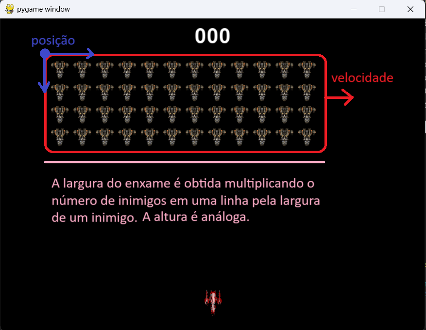

# Space Invaders com Orientação a Objetos 

**Contexto**: Neste laboratório, iremos implementar uma versão simplificada do jogo Space Invaders usando Programação Orientada a Objetos em Python e a biblioteca pygame. Se você não conhece o jogo Space Invaders, veja o *gameplay* [neste vídeo](https://www.youtube.com/watch?v=MU4psw3ccUI).

**IMPORTANTE**: Este é um projeto relativamente grande. Use como referência os slides e o código do jogo Breakout disponibilizado no AVA. A mesma lógica de usar uma lista para armazenar os tijolos do muro no Breakout será utilizada para representar o enxame de inimigos.

**Tela do Jogo**: A figura abaixo ilustra a tela da nossa versão do jogo. O jogador controla a nave localizada na parte inferior da tela e seu objetivo é destruir as naves inimigas do topo da tela. Tanto o jogador quanto as naves inimigas podem lançar tiros. Os tiros do jogador são retângulos vermelhos e os tiros dos inimigos são retângulos azuis. O jogador recebe pontos ao destruir naves inimigas e perde pontos ao receber tiros. O objetivo do jogo é maximizar a pontuação. A pontuação é exibida no topo da tela. 


**Classes do Projeto**: Analisando a tela do jogo podemos identificar alguns tipos de objetos como o jato do jogador, as naves inimigas e os tiros. Estes tipos de objetos virarão classes em nosso projeto. Além destas, utilizaremos classes as auxiliares Vetor2D e Cronometro desenvolvidas para o jogo Breakout. Por fim, criaremos uma classe para representar o jogo e esta classe será responsável por coordenar os objetos do jogo e suas interações, além de gerenciar a pontuação da partida.

## Iniciando o Projeto com o Personagem do Jogador

Crie uma pasta para armazenar o projeto, faça o download das imagens usadas no jogo do AVA e descompacte o arquivo na pasta do projeto. Faça o download também dos arquivos uteis e extraia na pasta do projeto. Os arquivos úteis contém funções para ler imagens (em utils.py) e as classes Vetor2D (em vetor_2d.py) e Cronometro (em cronometro.py). 

Neste primeiro momento, crie os seguintes arquivos: 

1. jato.py: vai conter a classe Jato que representa o personagem do jogador. 
1. space_invaders.py: vai conter a classe SpaceInvaders representando o jogo. 
1. main.py: irá criar um objeto do tipo SpaceInvaders e iniciar o jogo. 
1. config_jogo.py: irá conter a classe ConfigJogo com constantes usadas no jogo. 

No arquivo ConfigJogo, crie constantes para representar o tamanho da tela do jogo e o tamanho da imagem do jato controlado pelo jogador, ambos do tipo Vetor2D.

No arquivo jato.py, crie a classe Jato que representa a nave do jogador. Observe que o controle e movimento da nave é similar à barra no jogo Breakout. 

* **Construtor**: A classe Jato deve receber como argumentos no construtor a posição e a velocidade do objeto, ambos do tipo Vetor2D. Ainda no construtor, use a função ler_imagem (módulo utils.py) para carregar a imagem do jato em ```sprites/jato.png``` e salve a imagem como um atributo do objeto. O tamanho da imagem deve ser aquele definido na classe ConfigJogo. 

* **Atualização de Estado**: Implemente o método atualiza_estado na classe Jato somando a velocidade à posição do jato e armazenando o resultado em uma variável ```nova_posicao```. Verifique se ```nova_posicao``` é válida (não saiu da tela) e, se sim, atualize o atributo que representa a posição do jato. 

* **Desenho**: Implementa o método desenha na classe Jato que recebe como entrada a tela onde o personagem será desenhado. Use a função blit para desenhar a imagem do jato na tela em sua posição atual. 

Para testar se o que fizemos até agora está funcionando como esperado, vamos começar a implementar a classe SpaceInvaders. Crie a classe no arquivo space_invaders.py e implemente os seguintes métodos: 

* **Construtor**: No construtor da classe SpaceInvaders, inicialize o pygame, crie uma tela e a armazene como atributo do objeto. Por fim, crie um objeto do tipo Jato e também o armazene como um atributo. A coordenada x da posição inicial do jato deverá ser o centro da tela e a posição y um valor pré-definido na classe ConfigJogo, localizado na parte inferior da tela.

* **Loop do Jogo**: Implemente o método executar que realiza o loop principal do jogo, i.e., tratamento de ventos, atualização do estado do jogo e desenho da tela do jogo:

```
def executar(self):
    while True:
        self.tratamento_eventos()
        self.atualiza_estado()
        self.desenha()
```

* **Tratamento de Eventos**: Implemente o método tratamento_eventos da classe SpaceInvaders de forma que se a tecla "A" estiver pressionada, a velocidade do Jato seja definida como um vetor para a esquerda; caso contrário, se a tecla "D" estiver pressionada, a velocidade seja definida como um vetor para a direita; caso contrário, se nenhum das duas teclas estiver pressionada, o vetor velocidade do jato deverá voltar a ser (0, 0). Adicione ainda o tratamento de evento de saída que sejamos capazes de encerrar o jogo pressionando ESC: 

```
if pygame.key.get_pressed()[pygame.K_ESCAPE]:
    pygame.quit()
    sys.exit(0)
```

* **Atualização de Estado**: Implemente o método atualiza_estado. Neste momento, apenas chamaremos o método atualiza_estado do jato. 

* **Desenho da Tela**: Implemente o método desenha. Nesta versão inicial, vamos apenas usar a função fill para limpar a tela, chamar o método desenha da classe Jato passando a tela como argumento e, por fim, chamar a função flip para atualizar a janela do jogo. 

No arquivo main.py, crie a função main e nela crie um objeto do tipo SpaceInvaders e invoque o método executar(). Lembre-se de executar a função main usando a estrutura: 

```
from space_invaders import SpaceInvaders


def main():
    jogo = SpaceInvaders()
    jogo.executar()


if __name__ == "__main__":
    main()
```

Execute o jogo e verifique se o personagem aparece na tela e se a movimentação está acontecendo como esperado. Verifique se os limites da tela estão sendo obedecidos. 

## Inimigos

Crie a classe Inimigo em inimigo.py usando a mesma lógica da classe Jato. Em seguida: 

1. Na classe SpaceInvaders, crie um inimigo na parte superior da tela e com velocidade para a direita. 
1. Nos métodos atualiza_estado e desenha da classe SpaceInvaders, chame os respectivos métodos da classe Inimigo. 
1. Modifique o método de atualização de estado da classe Inimigo de forma que a velocidade do inimigo na direção horizontal seja invertida sempre que o inimigo alcançar os limites da tela. 

Execute o jogo novamente e verifique se de fato o inimigo inicia se movendo a direita e inverte o movimento na direção horizontal sempre que chega ao limite da tela. 

## Tiros do Jogador 

Crie um arquivo tiro.py e nele crie a classe Tiro. Os Tiros serão basicamente retângulos e, portanto, esta classe será similar à clases Barra do jogo Breakout. 

* **Construtor**: O construtor da classe Tiro irá receber como argumentos a posição, a velocidade, a cor e o tamanho do retângulo que define o tiro. Os valores devem ser armazenados como atributos do objeto. 

* **Atualização de Estado**: Implemente o método atualiza_estado somando a velocidade à posição do retângulo. Diferente dos de mais objetos, **não** crie restrições para garantir que o tiro esteja nos limites da tela. Os tiros poderão continuar o movimento além da área visível. 

* **Desenho**: Implemente o método desenha e use a função ```pygame.draw.rect``` para desenhar o tiro na tela. 

* **Verificação se o tiro está na tela**: Posteriormente, vamos querer remover do jogo os tiros que já saíram da tela. Para isto, crie um método esta_na_tela na classe Tiro que retorne verdadeiro se o tiro está na área visível do jogo e falso, caso contrário. 

Na classe SpaceInvaders, realize as seguintes modificações: 

* **Construtor**: Crie um atributo para armazenar a lista de tiros lançados pelo jogador. Use type hints para garantir que o VSCode será capaz de acessar os métodos da classe Tiro. Para evitar que o jogador possa realizar muitos tiros consecutivos, vamos criar também um cronômetro para controlar quanto tempo passou desde o último tiro dado.

```
self._tiros_jato: List[Tiro] = []
self._cron_espera_tiro_jato = Cronometro()
```

* **Tratamento de Eventos**: No método de tratamento de eventos, verifique se a tecla de espaço (```K_SPACE```) está pressionada. Em caso afirmativo, use o método tempo_passado da classe Cronometro para verificar se já passou um tempo mínimo desde o último tiro. Se sim, adicione um objeto do tipo tiro na lista com velocidade para cima e reinicie o cronometro usando o método reset.

* **Atualização de Estado**: Itere sobre os tiros da lista e invoque o método de atualização do estado de cada um deles. Após atualizar a posição dos tiros precisamos verificar se eles saíram da área visível do jogo e, em caso afirmativo, podemos remover o tiro. Podemos fazer isto usando o seguinte loop for: 

```
for tiro in self._tiros_jato:
    if not tiro.esta_na_tela():
        self._tiros_jato.remove(tiro)
```

* **Desenho**: Itere sobre os tiros da lista e invoque o método de desenho de cada um deles. 

Execute o jogo e verifique se o personagem é capaz de atirar e se os tiros estão se comportando como esperado.

## Tiros dos Inimigos

Usando a mesma lógica dos tiros do jogador, crie uma lista de tiros dados pelo inimigo. Os tiros do inimigo não são controlados por teclas dado que o inimigo não é controlado pelo jogador. A cada instante, vamos assumir que o inimigo realiza um tiro com 30% de chance e, como no caso do jogador, se um determinado tempo passou desde o último tiro. Para realizar a ação com 30% de chance, vamos produzir um número aleatório entre 0 e 1 e verificar se o valor é menor que 0.3. Esta condição só será verdedeira em 30% do tempo! 

```
# LEMBRE-SE DE IMPORTAR A BIBLIOTECA random 

if random.random() < 0.3:
    if self._cron_espera_tiro_inimigo.tempo_passado() > ConfigJogo.ESPERA_TIRO:
        self._cria_tiro_inimigo() 
        self._cron_espera_tiro_inimigo.reset()
```

O método _cria_tiro_inimigo deve adicionar um novo tiro na lista de tiros do inimigo. A coordenada x da posição inicial do tiro deve ser no meio do inimigo e a coordenada y deve ser no fim do inimigo. A velocidade do tiro deve ser para baixo. 

Execute o jogo e verifique se os tiros do inimigo estão se comportando como esperado. 

## Pontuação 

Vamos criar um sistema de pontuação preliminar para o jogo de forma que o jogador receba pontos se seus tiros atingirem o inimigo e perca pontos se ele for atingido por tirosdo inimigo. No construtor da classe SpaceInvaders crie um atributo pontuação inicialmente com valor zero e crie uma fonte que usaremos posteriormente para desenhar a pontuação na tela. 

```
self._font = pygame.font.SysFont(None, 48)
```

Vamos criar um método _tratamento_colisoes para verificar se tiros do inimigo atingiram o personagem e se tiros do personagem atingiram o inimigo. O método _tratamento_colisoes deve ser invocado ao final do método de atualização de estado da classe SpaceInvaders. 

No método _tratamento_colisoes, vamos iterar sobre os tiros dos inimigos e verificar se aconteceu uma colisão com o personagem do jogador. Em caso afirmativo, vamos decrementar a pontuação do jogador e remover o tiro da lista para destruí-lo. O teste de colisão entre retângulos no pygame é feito usando o método colliderect. Contudo, este método é invocado e recebe como parâmetros objetos da classe pygame.rect.Rect. O trecho de código abaixo ilustra como criar objetos desta classe e atualizar a pontuação com base no teste de colisão. 

```
# Retangulo do personagem 
rect_jato = pygame.rect.Rect(
    self._jato._posicao.x,
    self._jato._posicao.y,
    ConfigJogo.TAM_JOGADOR.x,
    ConfigJogo.TAM_JOGADOR.y)

for tiro in self._tiros_inimigos:
    # Retangulo do tiro
    rect_tiro = pygame.rect.Rect(
        tiro.posicao.x,
        tiro.posicao.y,
        ConfigJogo.TAM_TIRO.x,
        ConfigJogo.TAM_TIRO.y)

    # se o retangulo do jato colidiu com o retangulo do tiro
    if rect_tiro.colliderect(rect_jato):
        # destroi o tiro removendo-o da lista 
        self._tiros_inimigos.remove(tiro)
        # decrementa a pontuação do jogador 
        self._pontuacao -= ConfigJogo.PONTUACAO_JATO_RECEBER_TIRO
```

Usando a mesma lógica, realize o tratamento das colisões dos tiros do jogador com o inimigo. 

No método desenha da classe SpaceInvaders, escreva a pontuação do jogador na tela: 

```
# cria uma imagem a partir da string
img = self._font.render(f'{self._pontuacao:03d}', True, (255, 255, 255))

# posicao em que o texto será desenhado 
px = (ConfigJogo.DIM_TELA.x - img.get_width()) // 2
py = int(ConfigJogo.DIM_TELA.y * 0.02)

# desenha a imagem na tela
self._tela.blit(img, (px, py))
```

Execute o jogo e verifique se a pontuação está sendo modificada como esperado. 

## O Último Passo: O Enxame de Inimigos 

Para finalizar o nosso jogo, precisamos substituir o nosso inimigo solitário por um enxame de inimigos. Assista ao [gameplay](https://www.youtube.com/watch?v=MU4psw3ccUI) novamente e veja como o enxame se move como uma estrutura única (invisível) em formato de retângulo. Algo como um invólucro ou um contêiner. Mesmo quando fileiras inteiras de inimigos morrem, a estrutura continua se movendo como se estivesse completa. A figura abaixo torna visível o retângulo que envolve o enxame, sua posição e velocidade. 



Sempre que o retângulo toca os limites esquerdo e direito da tela, a velocidade na direção horizontal é invertida e a posição do eixo y é incrementada de forma que o enxame se aproxime do personagem. Se necessário, veja o [vídeo](https://www.youtube.com/watch?v=MU4psw3ccUI) novamente para observar esta dinâmica. 

**A Classe Enxame e seu Construtor**: Vamos criar uma classe para representar o enxame. Crie o arquivo enxame.py e nele crie a classe Enxame. Na classe enxame, crie um lista para armazenar os inimigos que compõe o enxame e use *type hints* para que o VSCode seja capaz de sugerir os nomes de atributos e métodos da lista: 

```
from inimigo import Inimigo

class Enxame:
    def __init__(self):
        self._inimigos: List[Inimigo] = []
```

A seguir, vamos criar um método chamado ```_criar_enxame``` para criar os inimigos e adicioná-los na lista. Assim como o muro no Breakout é composto por barras organizadas em linhas e colunas, o enxame será composto de inimigos organizados em uma estrutura similar. O número de linhas e colunas do enxame serão parâmetros pré-definidos na classe ConfigJogo. Inspire-se no método ```cria_muro``` da classe ```Breakout``` para implementar o método ```_criar_enxame```. Invoque o método no construtor após a criação da lista de inimigos vazia para criar e adicionar os inimigos na lista. 

Por fim, crie atributos no construtor para armazenar a posição, o tamanho e a velocidade do enxame (como se ele fosse um retângulo). Vamos definir a posição inicial como o limite esquerdo da tela (x = 0) e em uma altura pré-definida na classe ConfigJogo. Como indicado na figura acima, no tamanho, a largura será o produto do número de colunas da "matriz" de inimigos pela largura de um inimigo e a altura será o produto do número de linhas da "matriz" pela altura de um inimigo. Note que a suposta matriz não existirá de fato no código, mas apenas uma lista de inimigos. Vamos definir a velocidade como sendo positiva no eixo x e zero no eixo y para que o enxame inicie se movendo para a direita. Note que ao adicionar os inimigos na lista, suas velocidades devem ser iguais àquela do retângulo que contém o enxame. 

**Desenhando o Enxame na Tela**: Implemente o método desenha para desenhar o enxame na tela. Este método será bem simples e irá apenas iterar sobre os inimigos na lista e chamar o método desenha para cada um deles. 

**Atualização de Estado**: Implemente o método atualiza_estado. Este método deverá atualizar a posição do retângulo que define o enxame e dos inimigos que pertencem ao enxame. Para isto, inicie fazendo um loop for para iterar sobre os inimigos e invocar o método de atualização do estado para cada um deles. Em seguida, verifique se o retângulo que representa o enxame chegou ao limite da tela. Em caso afirmativo, atualize a posição do retângulo e de todos os inimigos para um pouco mais para baixo no eixo y e inverta a velocidade no eixo horizontal para o enxame passar a se mover para o outro lado. 

**Uso do Enxame na classe SpaceInvaders**: Modifique a classe SpaceInvaders para ao invés de criar um inimigo, criar um objeto do tipo Enxame. Substitua os usos da classe Inimigo pela classe Enxame. No trecho onde criávamos um tiro à partir do inimigo com 30% de chance, vamos selecionar um inimigo aleatório usando a função random.choice e lançar o tiro a partir dele. Primeiro, modifique o método ```_cria_tiro_inimigo``` para receber como argumento o inimigo que irá produzir o tiro. Em seguida, atualize o trecho que produz o tiro:

```
# se passou um tempo mínimo desde o último tiro
if self._cron_espera_tiro_enxame.tempo_passado() > ConfigJogo.ESPERA_TIRO:

    # se ainda existem inimigos vivos
    if len(self._enxame._inimigos) > 0:

        # selecione um inimigo aleatorio
        inimigo = random.choice(self._enxame._inimigos)

        # lance um tiro a partir deste inimigo
        self._cria_tiro_inimigo(inimigo)

        # reinicie o contador de tempo
        self._cron_espera_tiro_enxame.reset()
```